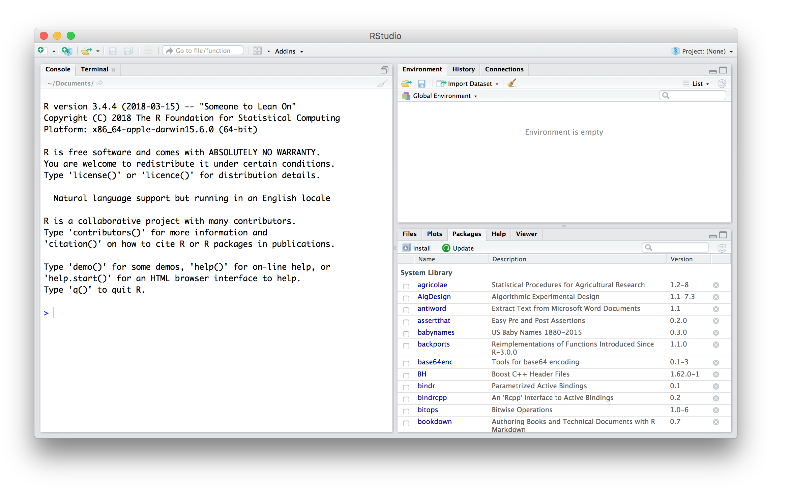
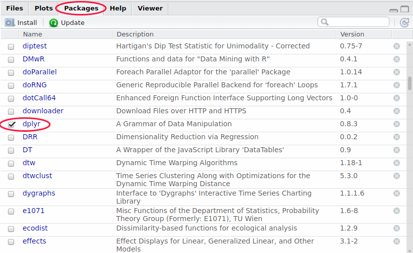

---
title: "Taller de introducción a R"
author: "R-ladies Bilbao"
output:
  html_document:
    highlight: default
    number_sections: yes
    theme: readable
    toc: yes
    toc_depth: 2
    toc_float:
      collapse: no
      smooth_scroll: no
  word_document:
    toc: yes
    toc_depth: '2'
---

<style type="text/css">

body{ /* Normal  */
      font-size: 16px;
  }
td {  /* Table  */
  font-size: 18px;
}
h1.title {
  font-size: 27px;
  color: Purple;
}
h1 { /* Header 1 */
  font-size: 24px;
  color: Purple;
}
h2 { /* Header 2 */
    font-size: 22px;
  color: Purple;
}
h3 { /* Header 3 */
  font-size: 18px;
  font-family: "Times New Roman", Times, serif;
  color: Purple;
}
code.r{ /* Code block */
    font-size: 16px;
}

</style>


```{r setup, include=FALSE}
knitr::opts_chunk$set(echo = TRUE)
```

-----------------------------

# Introducción a R y RStudio

[Presentación](https://github.com/RLadiesBIO/Presentaciones-Aurkezpenak/tree/master/2019-06-27_PrimerEncuentro_LehenTopaketa) 


$~$ 

# Conceptos básicos de R
$~$ 

## Hola mundo

R se puede usar como calculadora. Puedes escribir las operaciones y ejecutarlas en la consola. Por ejemplo, la suma de dos valores:

```{r}
3 + 6
(2 + 2)* 10
```

R también realiza operaciones más complejas como logaritmos o senos y cosenos (etc.):

```{r}
log(20)
cos(4)
```


También puedes escribir las operaciones en el script y ejecutarlo haciendo click en el botón  **Run** situado en la parte superior derecha de la ventana del script. De esta manera, puedes ir creando un script con todo el código que quieras.

Prueba a ejecutar el siguiente comando desde el script:

```{r2}
print("Hello World!")
```

$~$ 

## Configuración inicial
$~$ 

### Definir el directorio de trabajo (working directory)

El directorio de trabajo es la caperta de tu ordenador en la que estás trabajando. Cuando lees un archivo con R, R lo busca en el directorio de trabajo que le has especificado. Cuando guardas un archivo de datos o una figura con R, R la guarda en el directorio de trabajo especificado.

* Consultar el directorio de trabajo actual:
```{r2, eval=F}
getwd()
```

* Definir el directorio de trabajo. Cuando se empieza un trabajo con R es importante especificar el directorio de trabajo donde se encontrarán los scripts y archivos del proyecto:

```{r, eval=F}
setwd("/path/to/directory")
```
$~$ 

### Librerías o paquetes 


Cuando instalamos R por primera vez, lo que estamos instalando se conoce como "R Base", es decir, las funcionalidades básicas de R. Una de las ventajas de R es que, al ser un lenguaje de código abierto, la propia comunidad de R desarrolla nuevas extensiones de R; estas extensiones se conocen como librerías o paquetes de R.


Hay muchos paquetes disponibles, se encuentran sobre todo en el repositorio oficial de librerias de R: [CRAN](https://cran.r-project.org/). Para poder usar un paquete (por ejemplo, "dplyr")  hay que instalarlo en el ordenador y cargarlo en R, de la siguiente manera: 

* Instalar un paquete:
```{r2, eval=F}
install.packages("dplyr")
```

* Cargar un paquete:
```{r2, eval=F}
library("dplyr")
```

En la pestaña "Packages" de la ventana inferior izquierda de RStudio se pueden ven los paquetes instalados. Los paquetes ya cargados aparecen con un &#10003;. Otra manera de cargar paquetes es haciendo click directamente en el en la casilla correspondiente al paquete:
 
$~$ 
     


$~$ 

Los paquetes de R suelen estar, en general, bastante bien documentados; cuentan con información y ayuda para el usuario sobre las funcionalidades, así como ejemplos sencillos de la manera de usar las funciones del paquete. Hay dos principales fuentes de ayuda referentes a los paquetes:


* Help:
```{r2, eval=F}
help("dplyr")
```


* Vignetes:
```{r2, eval=F}
vignete("dplyr")
```


$~$ 

### Prácticas de buen uso

Una práctica de buen uso en la programación es comentar el código que vamos desarrollando. De esta manera, será más fácil de entender el código si volvemos a abir el script después de un tiempo o lo compartimos con otras personas. En R, cualquier texto despúes de un # no se ejecuta. 

* Escirbir comentarios:

```{r2, eval=F}
# Esto no se ejecuta
```


$~$ 

**Ejercicios**

* Crear una carpeta con un script llamado miprimerscript.R.
* Definir el working directory en el script como la carpeta contenedora.
* Instalar y cargar el paquete "markdown". Ver vignette.
* Comentar en el script que hemos instalado el paquete "markdown".


$~$ 

-----------------------------


$~$ 

## Objetos de R

$~$

### Variables

Una variable es una letra o palabra que almacena un valor. Para asignar un valor a una variable se utiliza el operador de asignación **`<-`**:

```{r}
x <- 3
MiNumero <- 9
```


Ahora, `x` se denomina una variable y aparece en la ventana superior derecha de RStudio **workspace window**. En esta ventana aparecerán todos los objetos que vayamos guardando durante la sesión. R los almacena en la memoria de manera que puedan ser usados más adelante.

Si ahora escribimos el nombre de la variable, el valor de ésta se imprimirá en la consola:

```{r}
x
```

Hay algunas variables especiales predefinidas en R, como por ejemplo el número Pi:

```{r}
pi
```

Ahora, podemos hacer operaciones con/entre las variables:

```{r}
x + 2
x + MiNumero
```

Y almacenarlas en nuevas variables:

```{r}
y = x*2
y
```


Cambiar el valor de una variable:

```{r}
y = 2500
y
```


O reescribirlas:

```{r}
y = y + 1
y
```


$~$

**Ejercicio**

* Crea dos variables `a` y `b`con valores 100 y 20, correspondientemente y una nueva variable `z` que sea la división de `a` entre`b`.

$~$

### Vectores
$~$
Los vectores son una sequencia de valores y en R se crean usando `c()`:

* Numéricos: 1, 2, 3
```{r}
x <- c(1, 2, 3); 
x
is.numeric(x)
```

* Caracteres: "a", "b", "c"
```{r char}
x <- c("a", "b", "c"); 
x
is.character(x)
```

Podemos acceder a los elementos de los vectores haciendo uso de los corchetes `[]` y el índice correspondiente:

```{r}
x[1] 
```


Y podemos saber si se cumple una condición en un vector:

```{r}
x == 'a'
```

y dónde:

```{r}
which(x == 'a')
```


Podemos nombrar los elementos de un vector con `names()`:

```{r}
miVec <- c(1,2,3) 
names(miVec) <- c("col1", "col2", "col3")
miVec
```


Podemos concatenar dos vectores:


```{r}
v1 <- c(1,2,3) 
v2 <- c(4, 5, 6)
v3 <- c(v1,v2)
v3
```


Y consultar la longitud de un vector con la function `length()`:

```{r}
length(v3)
```


Se pueden hacer operaciones con vectores (suma, resta...) por elementos utilizando los operadores normales. Si queremos hacer una multitplicación vectorial (matemáticamente hablando, el producto escalar) hay que usar el operador de mutiplicación matemática `%*%`:


```{r}
v1*v2
v1%*%v2
```

$~$

**Ejercicios:**

* Crea 2 vectores y suma sus primeros elementos.
* Crea un tercer vector que sea la concatenación del primero con el doble del segundo.

$~$

### Matrices y Dataframes


* Matrices (2D): estructuras bi-dimensionales con datos del mismo tipo. Se crean utilizando la function `matrix()`:

```{r}
miMat <- matrix(v3, nrow=2, ncol=3, byrow=TRUE)
miMat
```

Dado un objeto, puedes prefuntarle a R qué tipo de objeto es tilizando la function `class()`:
```{r matrix}
class(v3)
class(miMat)
```


* Data Frames (2D): estructuras bi-dimensionales con datos no necesariamente del mismo tipo. Se crean utilizando la function `data.frame()`:


```{r df}
v1 <- c(1,2,3)
v2 <- c("a","b","c")
miDF <- data.frame(Col1=v1, Col2=v2)
miDF
```


Podemos unir matrices por fila o columna, utilizando `rbind()` y`cbind()`, correspondientemente:

```{r}
miMat1 <- matrix(v3, nrow=2, ncol=3, byrow=TRUE)
miMat2 <- matrix(v3, nrow=2, ncol=3, byrow=FALSE)

rbind(miMat1, miMat2)
cbind(miMat1, miMat2)
```

$~$

**Ejercicios**

* Crea las matrices siguientes y concaténalas (atentx a las dimensiones para saber si concatenar por fila o columna):

$$
\begin{pmatrix}
1 & 4 & 3\\
8 & 5 & 1
\end{pmatrix}
\begin{pmatrix}
9 & 1 & 6\\ 
7 & 6 & 4
\end{pmatrix}
$$

$~$

## Funciones
$~$

### Funciones básicas de R


Una función es una interfaz a la que el usuario le da un(os) argumento(s) (input) y ésta le devuelve un resultado (output) que es el resultado de haber realizado operaciones al input. Por ejemplo, la función `sqrt(x)` calcula la raíz cuadrada de `x`:

```{r}
sqrt(9)
```


Para calcular la media de 3 números, podemos calcularla a mano:

```{r}

(3+4+5)/3
```

O podemos calcular utilizando la funcion `mean()`:

```{r}
x <- c(3,4,5)
mean(x)
```


Otro ejemplo muy útil es `seq()` para crear secuencias. Utilizando el operador `a:b`,  R nos devuelve la secuencia entre `a`y `b`, mientras que si queremos la secuencia cada 2 números hacemos uso de `seq()`:

```{r}
1:10
seq(from=1, to=10, by=2)
```


Otra función básica como útil es `rep()`, que repite el argumento de la primera posición tantas veces como le indiques en la segunda posición; es decir:

```{r}
rep(1, 10)
rep(c(1,2,3),5)
```


Podemos usar estas funciones para operar con vectores:
```{r}
v <- 1:20
v
v[seq(1,20,2)]
```

```{r}
v[1:5] <- 0
v
```


$~$

**Recuerda**

 - **Corchetes** [ ] para ***acceder a índices***
 - **Paréntesis** () para ***argumentos de funciones***

$~$


Algunas veces los agumentos tienen valores por defecto (default), de manera que si el usuario no especifica ninguna valor se utilizar ese. Por ejemplo, la función `rnorm()`, que genera `n` número aleatorios que siguen una distribución normal de media 0 y desviación estándar 1:


```{r}
rnorm(n=10)
```


¿Cómo hacemos si queremos cambiar la media y desviación estándar?

$~$

### Ayuda de R


Para consultar información sobre una función (qué es lo que hace, qué argumentos recibe, las opciones...) contamos con la ayuda R. Para acceder a la ayuda de una función, tecleamos `?` y el nombre de la función:

```{r, eval=F}
?rnorm
help(rnorm)
```

Aparecerá una ficha de información con las siguientes secciones:

* `Description`: El objetivo de la función

* `Usage`: El modo de usarla

* `Arguments`: Una lista de los argumentos que recibe

* `Details`: Información más detallada de la función y sus argumentos

* `Value`: Información a cerca del output de la función

* `References`: Referencias de artículos útiles 

* `Examples`: Ejemplos de uso


De esta manera, si queremos generar 10 números aleatorios siguiendo una distribución normal de media 2 y desviación estándar 5:

```{r}
rnorm(n=10, mean=2, sd=5)
```


$~$

### Definición de funciones


Un nivel superior consiste en definir las propias funciones con `function()`. Para definir una función necesitamos:

* Un nombre

* Al menos un input

* Un output

Y se define de la siguiente manera:

```{r}
NombreDeLaFucion <- function(input){
  operaciones
  return(output)
}
```

Por ejemplo, podemos crear una función que, dado un número te devuela la raiz cuadráda del triple de ese número:

```{r, eval=T}
MiPrimeraFuncion <- function(x) {
  y <- sqrt(3*x)
  return(y)
}

MiPrimeraFuncion(20)
MiPrimeraFuncion(5)

```


$~$

**Ejercicio: **
 
Crea una función que dados 2 números:

  * Cree dos vectores. El primer vector será la secuencia del 1 al primer número. El segundo vector será la secuencia del primer numero al segundo número cada 2. 
  * Concatene esos vectores.
  * Calcule la desviación estándar de ese nuevo vector.
  * Imprima la desviación estándar.
  * Devuelva la multipicación del primer número por la desviación estándar. 
  

-----------------------------
